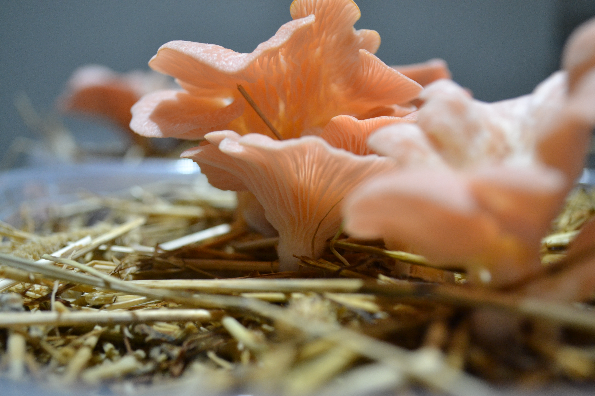
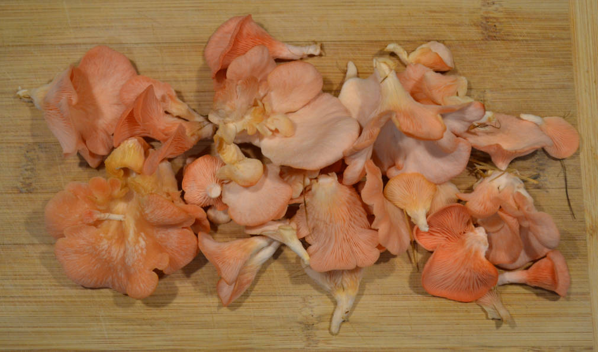
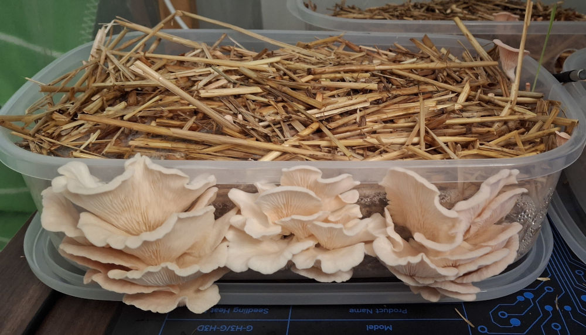
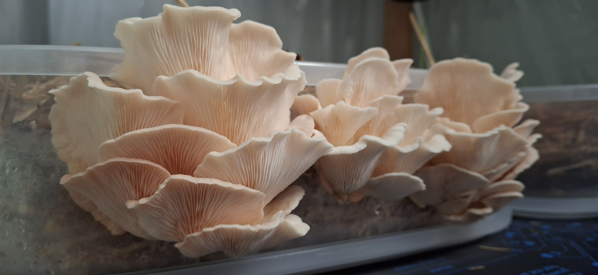

# 🍄 Farm Log

## Batch 1 — Pink Oyster (*Pleurotus djamor*)

### Growing

*First flush developing in the fruiting chamber.*

### Harvest

*First harvest — Batch 1.*

---

### Second Flush

*Second flush — full container view, fruiting through the sides.*

*Second flush — close-up of caps and gills. Pale cream colour due to high substrate temperature (25°C+); see [ENVIRONMENT.md](ENVIRONMENT.md) for details.*

---

*More batches to follow.*
