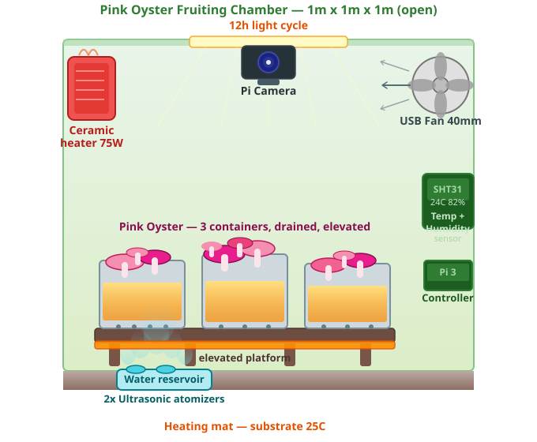

# 🍄 MushroomsFarm

A Raspberry Pi monitor for Pink Oyster (*Pleurotus djamor*) mushroom cultivation. It tracks temperature and humidity via an SHT31 sensor and provides a live camera view and manual humidifier controls through a local web dashboard — all running on a Pi 3 with under 10% CPU at idle.

The humidifier (2× ultrasonic atomizers) runs continuously on its own self-duty-cycling timer. The Pi monitors conditions and allows manual overrides but does not switch the humidifier via GPIO.

## Fruiting Chamber



## How It Works

Four threads run concurrently and share sensor state through a thread-safe data container:

- **SHT31** reads temperature and humidity from the sensor every 1.5 s over I2C and writes results to shared memory.
- **MoistureController** checks the latest humidity reading every 2 s and tracks humidifier state. Manual overrides from the web UI are respected until the humidity crosses the opposite threshold, at which point automatic control resumes. Target range: 80–85% RH.
- **Camera** starts the Pi camera in preview mode at 1 fps and serves JPEG snapshots on demand at `/snapshot`. Running at 1 fps rather than the default 30 fps cuts ISP CPU usage by ~80%.
- **HttpServer** serves the web dashboard and REST API on port 8080. Snapshot requests are proxied through this same port, avoiding any cross-origin browser issues.

## Hardware

| Component | Details |
|---|---|
| Board | Raspberry Pi 3 (also works on Pi 4) |
| Sensor | SHT31 temperature/humidity — I2C, address `0x44`, bus 1 |
| Humidifier | 2× Micro USB Ultrasonic Atomizer 108KHz — self-duty-cycling 5s on/5s off, in water reservoir |
| Camera | Raspberry Pi Camera Module (Picamera2) |

Wiring reference: [USB Power Switch Module](https://thepihut.com/products/usb-power-switch-module) · [SHT31 example](https://github.com/machineshopuk/SHT31/blob/master/SHT31.py)

## Project Structure

```
├── main.py                   # Entry point — wires and starts all subsystems
├── abs_worker.py             # Abstract base: runs any subclass in its own thread
├── shared_data.py            # Thread-safe container for sensor readings
├── sht31.py                  # SHT31 sensor reader (I2C)
├── moisture_controller.py    # GPIO humidifier controller with manual override
├── camera.py                 # On-demand JPEG capture, served on port 8000
├── httpserver.py             # REST API + dashboard server on port 8080
├── gpio_pins_distribution.py # GPIO pin constants
├── Environment               # Physical setup description
├── GROWING.md                # Step-by-step growing guide
├── service/
│   └── mushrooms.service     # systemd unit for auto-start on boot
└── web/
    └── index.html            # Web dashboard
```

## Software Requirements

```bash
pip install RPi.GPIO smbus picamera2
```

## Deploying to the Pi

```bash
# Copy source
scp *.py yurii@192.168.4.45:/home/yurii/MushroomsFarm/
scp web/index.html yurii@192.168.4.45:/home/yurii/MushroomsFarm/web/

# SSH in and run
ssh yurii@192.168.4.45
cd /home/yurii/MushroomsFarm
python main.py
```

Stop with `Ctrl+C` or `SIGTERM` — both are handled cleanly.

## Auto-start on Boot (systemd)

```bash
sudo cp service/mushrooms.service /etc/systemd/system/
sudo systemctl daemon-reload
sudo systemctl enable mushrooms
sudo systemctl start mushrooms

# Check status / logs
sudo systemctl status mushrooms
journalctl -u mushrooms -f
```

## Static IP Setup

```bash
sudo nmcli -p connection show                                          # find connection name
sudo nmcli c mod "Oxio" ipv4.addresses 192.168.4.45/24 ipv4.method manual
sudo nmcli c mod "Oxio" ipv4.gateway 192.168.0.1
sudo nmcli c mod "Oxio" ipv4.dns "8.8.8.8,8.8.4.4"
sudo reboot
```

Reference: [Set a static IP on Pi OS Bookworm](https://www.abelectronics.co.uk/kb/article/31/set-a-static-ip-address-on-raspberry-pi-os-bookworm)

## Web Dashboard

Open `http://192.168.4.45:8080` in any browser on the same network.

- Live camera snapshot (refreshes every 1 s)
- Current temperature and humidity
- Humidifier status with manual on/off override
- Error banner if the Pi is unreachable

## HTTP API

Base URL: `http://192.168.4.45:8080`

| Method | Path | Response |
|---|---|---|
| GET | `/status` | `{ "temp_c": 22, "humd": 85, "moisturizer_on": true }` |
| GET | `/temp` | Plain text temperature in °C |
| GET | `/humd` | Plain text humidity in % |
| GET | `/snapshot` | JPEG image of current camera frame |
| POST | `/humd/start` | Turn humidifier on (manual override) |
| POST | `/humd/stop` | Turn humidifier off (manual override) |

```bash
curl http://192.168.4.45:8080/status
curl http://192.168.4.45:8080/snapshot --output frame.jpg
```

## Humidifier Logic

Target range: **80–85% RH**

The humidifier (2× ultrasonic atomizers) runs continuously on its own built-in 5s on/5s off duty cycle — the Pi does not switch it via GPIO. The MoistureController monitors humidity and exposes manual on/off controls via the web UI and API for convenience.

| Condition | Action |
|---|---|
| humidity < 80% | humidifier **on** (manual override) |
| humidity > 85% | humidifier **off** (manual override) |
| 80–85% | hold current state, manual override cleared |

Manual overrides from the web UI or API take effect immediately. The auto-control cycle runs every 2 s and resumes once humidity crosses the relevant threshold.

## Pi 3 Performance Optimisation

The default Pi camera runs the ISP at 30 fps — expensive on a single-core. These changes bring CPU from ~90% down to ~7%:

| Change | CPU before | CPU after |
|---|---|---|
| Switch from continuous MJPEG encoding to on-demand JPEG capture | 89% | 47% |
| Cap camera to 1 fps (`FrameDurationLimits`) | 47% | 22% |
| Disable unnecessary systemd services | 22% | ~7% |

Disable services not needed for a headless controller:

```bash
sudo systemctl disable --now \
  avahi-daemon \
  dphys-swapfile \
  accounts-daemon \
  polkit \
  e2scrub_reap.timer \
  apt-daily.timer \
  apt-daily-upgrade.timer \
  man-db.timer \
  NetworkManager-wait-online.service \
  udisks2

sudo systemctl mask avahi-daemon   # prevent it being pulled back as a dependency
```

Reduce GPU memory in `/boot/firmware/config.txt` (minimum that keeps HDMI + camera working):

```ini
gpu_mem=64
```

Move logs to RAM to reduce SD card writes (extends card lifespan):

```
# /etc/fstab
tmpfs /tmp      tmpfs defaults,noatime,size=50m 0 0
tmpfs /var/log  tmpfs defaults,noatime,size=20m 0 0
```